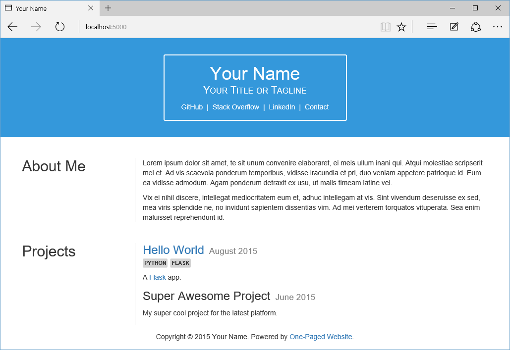

One-Paged Website
=================

A single-page website using [Flask](http://flask.pocoo.org), SQLite, and Jinja2.

For an AngularJS version, see [OnePagedWebsite-angular](https://github.com/ipavl/OnePagedWebsite-angular).

Set up
------

1. Run `app.py` to create the database
2. Edit the created `sqlite.db` file to add projects (see the [Database](#database) section below for details)
3. Change the links and "About Me" instances in `templates/index.html` as appropriate
4. Change `site_title` and `site_tagline` in `app.py`

By default, there is only a "Project" model, but the app can easily be extended to support other models if desired.

Database
--------

For the **Project** table, the following apply:

* `date` should be a string in the format of `YYYY-MM-DD`. The day (`DD`) portion is ignored when rendered on the page, but could be used to fine-tune the ordering of projects.
* `tags` should be a comma-delimited string of tags, e.g. `python,flask`.
* `description` supports [Markdown](http://daringfireball.net/projects/markdown).

Screenshot
----------

